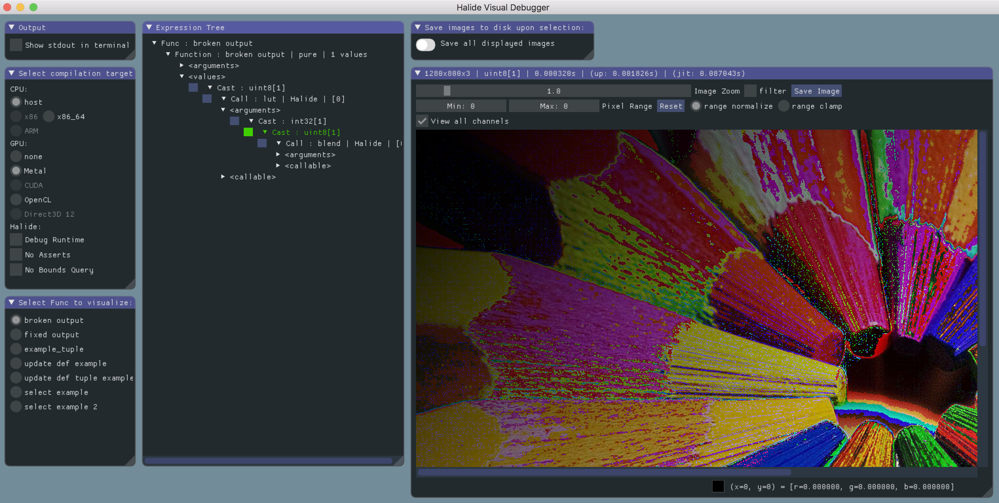

# Halide Visual Debugger

An interactive visual debugger for image processing kernels using Halide




## Usage:

The visual debugger can be added to an existing Halide application by including a header file (`include/debug-api.h`) and a couple of source files (see the _Amalgamation_ section below).

Ordinarily, one would execute a Halide pipeline as follows:
```
Func f = ...
f.realize(buffers...);
```

The visual debugger provides a `debug()` routine that wraps a `Func`, bringing in the interactive visual debugger:
```
#include <debug-api.h>
...
Func f = ...
debug(f).realize(buffers...);
```

In the code above, `debug(f).realize(...)` will act as a _breakpoint_, interrupting the normal execution of the caller, and launching an interactive visual debugger window like the one shown above. The debugger will not return control to the caller until the debugger window is closed, at which point the host program execution will resume as intended, with `f.realize(...)` getting called.

> **Note that the visual debugger requires Halide's JIT (just-in-time) compilation** -- AoT (ahead-of-time) compilation is **not** supported.


## Basic UI controls:

- use the *Expression Tree* panel to browse through sub-expressions
- click on the small square button to the left of a sub-expression to visualize it
- drag the mouse over the image while holding the left mouse button to scroll through the image
- hover the mouse over the image to inspect pixel values (right-click to select a particular pixel)
- hold `Ctrl` while moving the mouse-wheel to zoom-in/out
- hold `Ctrl` while clicking on the Min/Max range to input specific values to them
- The image window title displays: *execution time* | *host -> device buffer upload time* | *jit-compilation time*


## Amalgamation:

To facilitate integration with a host application, an amalgamation of the debugger source code is provided; simply add the following source files to your build to embed the debugger into a project:
- `src/amalg/amalg-cpp.cpp`
- `src/amalg/amalg-c.c`
- `src/amalg/amalg-m.m` (only if on MacOS)

> **Note that the amalgamations assume that all third party dependencies are properly placed in the `third-party` folder.
See below for details on third party dependencies.  
The simplest way to integrate the debugger in an application is to have the contents of `include`, `src` and `third-party` folders readily accesible to your project's source tree and build system.**


## About Third Party dependencies:

We assume that you already have Halide and its dependencies installed and linked properly against your application.

Besides Halide, the visual debugger also has the following dependencies:
- OpenGL
- [GLFW](https://www.glfw.org)
- [stb](https://github.com/nothings/stb) (more specifically, `stb`'s image IO routines)
- [Dear ImGui](https://github.com/ocornut/imgui)
- [Filesystem Add-on for Dear ImGui](https://github.com/Flix01/imgui/tree/2015-10-Addons/addons/imguifilesystem)

A snapshot of these dependencies is provided in the `third-party` folder. The source code amalgamation refers to code contained in this `third-party` folder, such that the host application don't need to worry about managing them.


## Demo program:

We provide a demo program to show how to use the visual debugger. It can be found in the `demo` directory, with an accompanying  cmake file (pay no attention to the `demo/developer` folder: it is intended only for people developing and maintaining the debugger).

The demo also demonstrates how to group multiple `Func`s for debugging through the `replay()` API, also present in `include/debug-api.h`. This allows one to capture the realization context of `Func`s and postpone their actual realization to a later point during the interactive visual debugging session (a list of available `Func`s for replay will be shown in the GUI).
